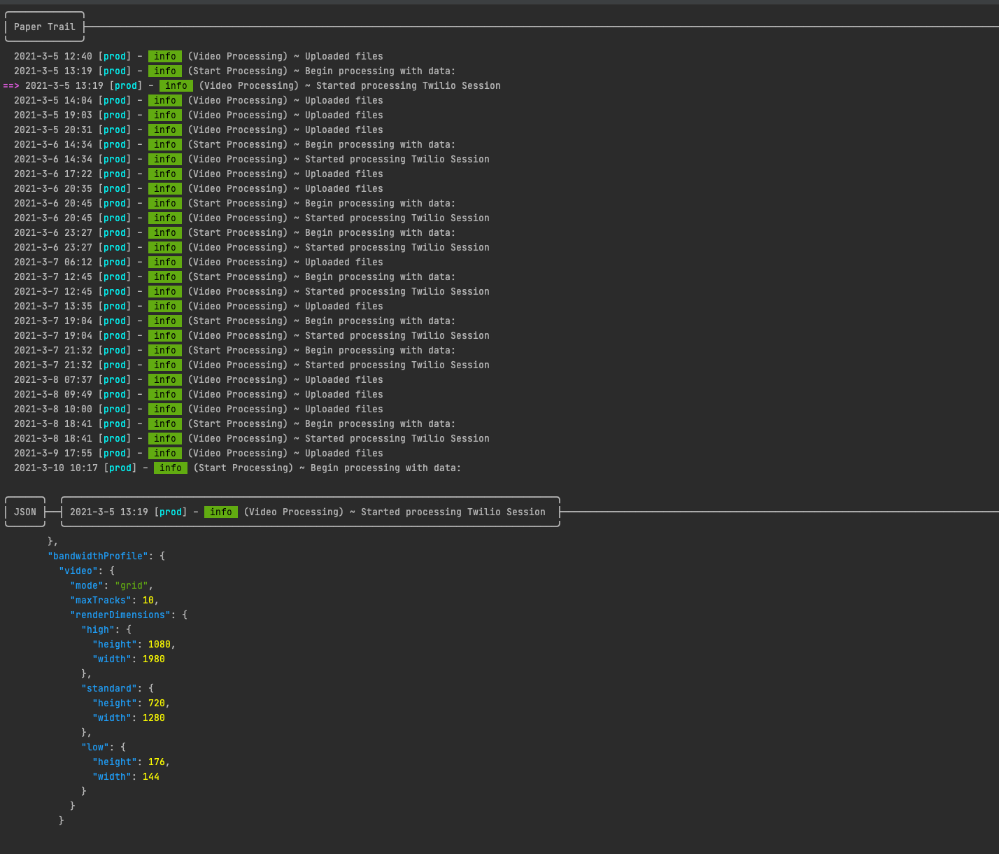

## How to Use
Get an API Key from Papertrail and set it as an env var
```bash
export PAPERTRAIL_KEY=yourkey
```

Then just run 
```bash
go get
go run main.go
```

It should display something like this
